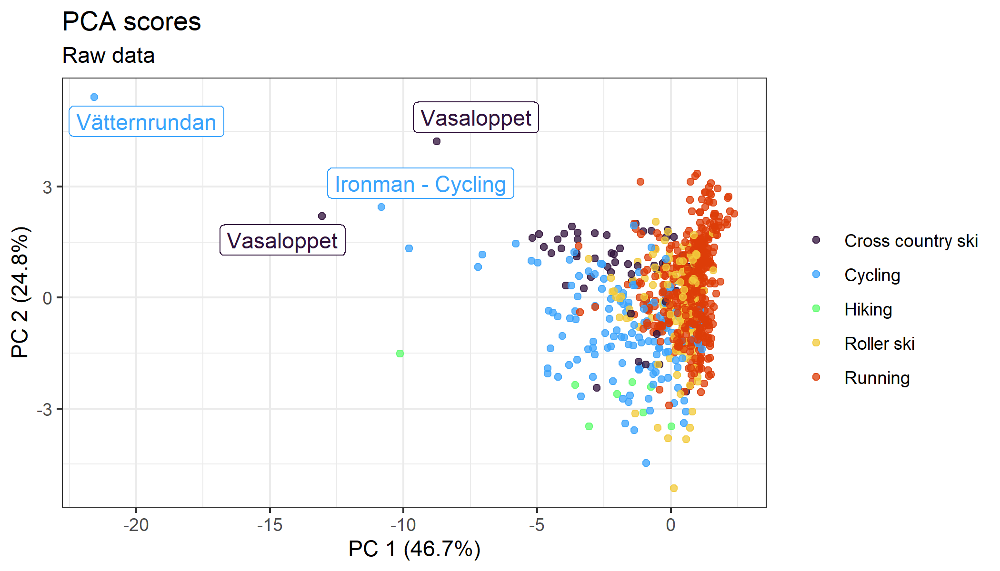
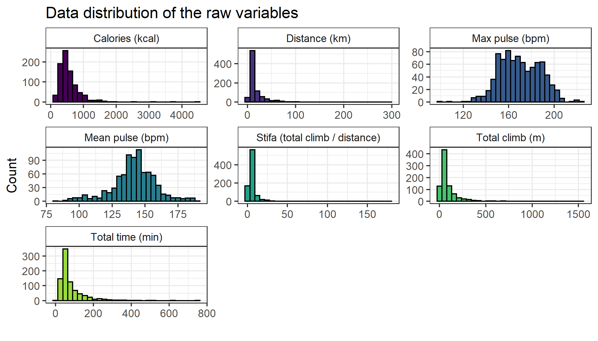
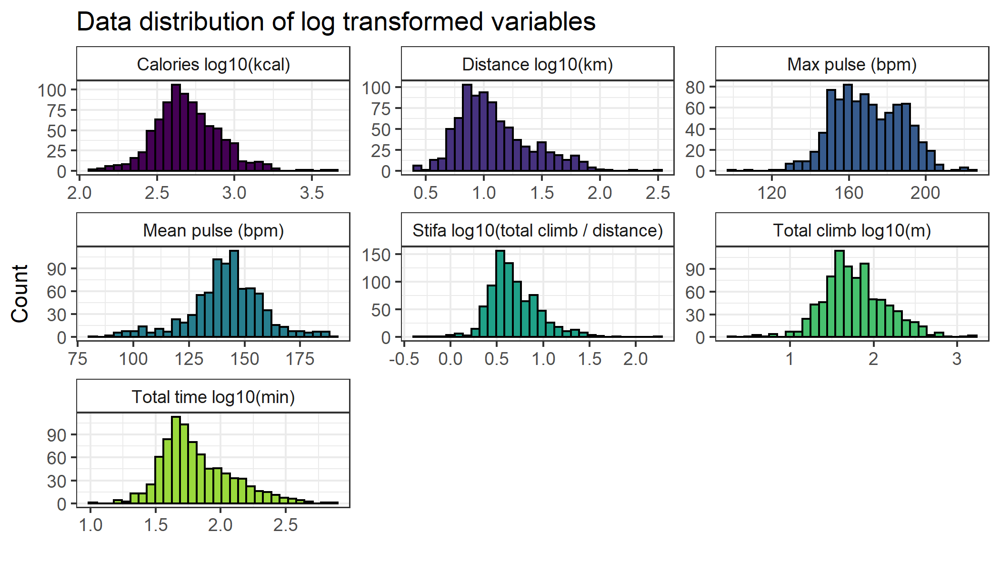
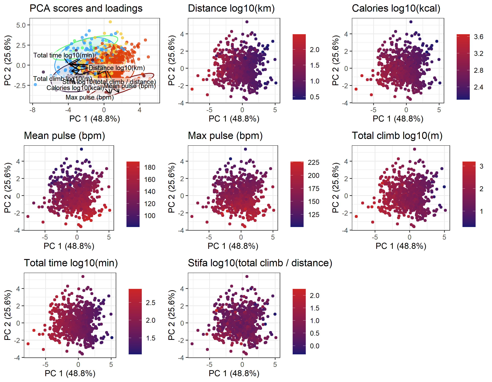
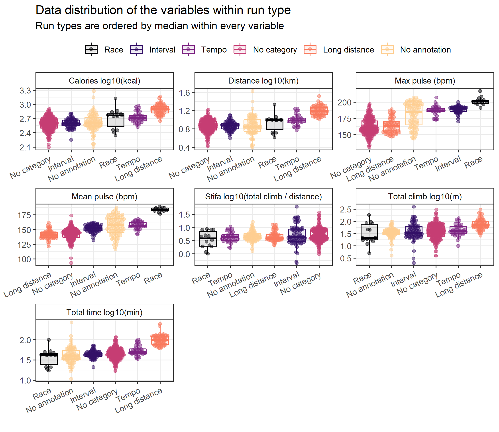

```{r setup, include = FALSE}
library(tidyverse)
library(kableExtra)
load("./output/data.Rdata")
```
This repo contains data analysis of my sports activity data during 2017 to 2022. Sports activities were tracked using a sports watch and the data was downloaded using Garmin connect. Activities of parts of the data during 2021 was plotted in my gpx_plotter repo: <https://github.com/kpullerits/gpx_plotter>. Seven measurements (variables) were used in this analysis:

* Distance (km)
* Calories (kcal)
* Mean pulse (bpm)
* Max pulse (bpm)
* Total climb (m)
* Total time spent (min)
* Stifa, "stigningsfaktor" in Swedish <https://www.stifa.se/> (total climb / distance)

*Table 1. Example of activity data.*

```{r, echo=FALSE}


df_clean %>% 
  select(activity, date, distance, calories, mean_pulse, max_pulse, tot_climb, tot_time,stifa) %>% 
  group_by(activity) %>% 
  slice_head(n = 2) %>% 
  head(10) %>%
  kable() %>% 
  kable_styling(font_size = 10)
```


## Exploratory analysis and preprocessing of data

Principal component analysis (PCA) was used in the analysis and is often used for dimensionality reduction (such as reducing seven variables/dimensions into two dimensions) and preserving as much of the variation in the data as possible. PCA analysis can often show outliers in the data.

I knew that the data should include some outlier activities with much longer distance and time. Thus, a first exploratory PCA analysis was done on the raw data (Fig. 1). It can be seen that activities such as "Vasaloppet", "Ironman" and "Vätternrundan" are outliers. This would likely be due to these races are longer in distance and take longer time than my normal activities. Vasaloppet is a 90 km cross country skiing race, Ironman cycling is 180 km and Vätternrundan is 300 km cycling. 

```{r, echo = FALSE}

```

*Figure 1. PCA analysis of the raw data. Text boxes indicate outliers.*

The data distribution of the seven variables were investigated (Fig. 2) since some variables such as distance and time seems to give more weight, based on the discussion around Fig. 1. It is shown that `Max pulse` and `Mean pulse` seem normally distributed while `Calories`,`Distance`, `Stifa`, `Total climb` and `Total time` are right scewed with some datapoints with high values. 

```{r, echo = FALSE}

```

*Figure 2. Data distribution of the seven variables in the dataset.*

The variables `Calories`,`Distance`, `Stifa`, `Total climb` and `Total time` were log-10 transformed and the data distributions looked more normally distributed after transformation (Fig. 3). 

```{r, echo = FALSE}

```

*Figure 3 Data distribution of the log transformed variables in the dataset. Max pulse and Mean pulse were not log transformed.*

## Data analysis

PCA analysis was done on the log transformed dataset (Fig. 4), showing similar clustering as Fig. 1. The outliers are still on the edges, but the overall clusering of data and activity types is more visible. It is seen in the bottom right corner that some running acivities are clustering together, these are running competitions, "Running race" (Fig. 5). 

```{r, echo = FALSE}
knitr::include_graphics("./output/p4_pca_log10.png")
```

*Figure 4. PCA analysis of the log transformed data.  Text boxes indicate the same outliers as in Fig. 1.*

Fig. 5 is showing the same PCA analysis as Fig. 4, but the running activities which are races is a separate group. Loadings are also shown where the running race activities show increased `Max pulse`and `Mean pulse` whereas cycling and cross country skiing have increased `Calories`,`Distance`, `Stifa`, `Total climb` and `Total time`.

```{r, echo = FALSE}
knitr::include_graphics("./output/p5_biplot_activity_and_race_same.png")
```

*Figure 5. PCA analysis of the log transformed data, showing both scores and loadings. The transparent ellipses show the 95% confidence level for a multivariate t-distribution.*

The data distribution of the variables within every sports activity was analyzed (Fig. 6). It is observed that running race tend to have increased `Max pulse`and `Mean pulse`. Cycling tend to have increased `Distance`. Hiking has low `Max pulse`and `Mean pulse`, likely since it is not as strenious as the other activities. Running acitivites seem to vary in `Max pulse` and `Stifa` and looks like the data has two distributions within these variables. The running activites were further analysed below.

```{r, echo = FALSE}
knitr::include_graphics("./output/p6_variable_signal_log10.png")
```

*Figure 6. Data distribution of the variables within every sports activity. Every point indicate one activity and are plotted with a beeswarm-plot where the frequency of data is indicated by the width. Boxplots are also shown in the background.*

### Correlation of variables

Variables were correlated within every sports activity (Fig. 7) and a PCA analysis was colored by every variable (Fig. 8). `Max pulse`and `Mean pulse` tend to correlate well, and so does `Calories`, `Total climb`, `Distance` and `Total time`. This was expected and shown earlier with the loadings in Fig. 5. `Stifa` seem to correlate well with `Total climb`.

```{r, echo = FALSE}
knitr::include_graphics("./output/p7_variable_correlation.png")
```

*Figure 7. Correlation of variables. Bottom left plots show linear regressions of every activity and variable pair. The transparent area shows the 95% confidence interval for predictions from the linear model. Black diagonal line indicates 1:1 relationship. Upper right shows the pearson correlation of the overall fit (in grey) and for all activities (colored).*

```{r, echo = FALSE}

```

*Figure 8. PCA analysis colored by every variable in the dataset. Fig. 5 is shown in the top left as reference.*

# Running data analysis

Running activites were analysed and annotated if the activity had been categorized as `Interval`, `Long distance`, `Race`, `Tempo` or `No category`. Activites which were not annoted were categorized as `No annotation`. The categorization was manually done by me after every run with these guidelines in mind:

* Interval: Shorter pulses of running time of 0 - 5 min or distance of 0 - 2 km 3-15 times with some rest in between.
* Long distance: Longer runs of > ~12 km or > 1.5 h.
* Race: Competitions such as 10 km, half marathons or marathons.
* Tempo: Similar to intervals but longer time or distance and fewer times.
* No category: If not categorized into the other categories the run ends up in this category. It can be runs with no specific purpose.

PCA analysis was done on the running data showing that Race, Tempo and Interval tend to have increased `Max pulse` and `Mean pulse`. Long distance seem to have increased `Total time`, `Distance` and `Calories`. The No category and No annotation categories are quite large, likely since many different run types are included here, especially in the No annotation category.

```{r, echo = FALSE}
knitr::include_graphics("./output/p9_biplot_running.png")
```

*Figure 9. PCA analysis of the running data, showing both scores and loadings. The transparent ellipses show the 95% confidence level for a multivariate t-distribution.*

The data distribution of the variables within every run type was analyzed (Fig. 10). Race activities usually have greatest `Max pulse` and `Mean pulse`. Long distance usually have long `Total time` and longest `Distance`.

```{r, echo = FALSE}

```

*Figure 10.  Data distribution of the variables within every run type. Every point indicate one activity and are plotted with a beeswarm-plot where the frequency of data is indicated by the width. Boxplots are also shown in the background.*

# Conclusion

Sports acitivty data was analysed and sports acitivties such as `Cross country ski` and `Cycling` tend to have greater `Distance` and `Total time`. `Running race` had higher `Max pulse` and `Mean pulse` compared to the other activity types. Within running, `Race`, `Tempo` and `Interval` tend to have increased `Max pulse` and `Mean pulse` while `Long distance` seem to have increased `Total time`, `Distance` and `Calories`.

`Distance`, `Total time` and `Calories` tend to correlate well. Which is expected since acitvities longer distances take more time to complete and longer time also increases the calories burnt.
