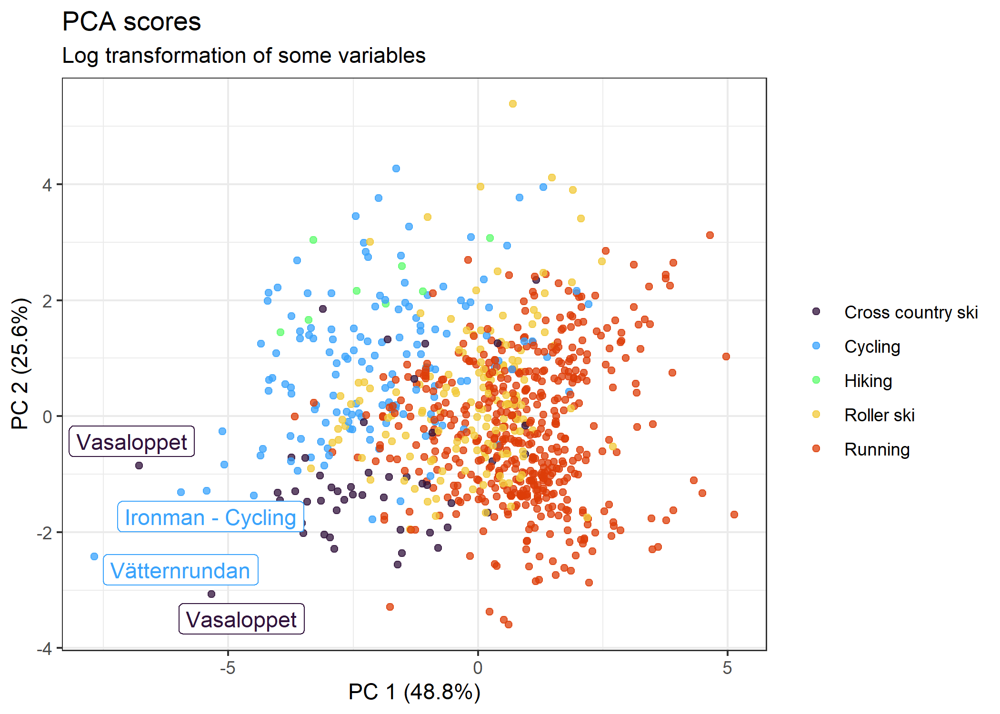

Data analysis of my sports activities
================

This repo contains data analysis of my sports activity data during 2017
to 2022. Sports activities were tracked using a sports watch and the
data was downloaded using Garmin connect. Activities of parts of the
data during 2021 was plotted in my gpx\_plotter repo:
<https://github.com/kpullerits/gpx_plotter>. Seven measurements
(variables) were used in this analysis:

-   Distance (km)
-   Calories (kcal)
-   Mean pulse (bpm)
-   Max pulse (bpm)
-   Total climb (m)
-   Total time spent (min)
-   Stifa, “stigningsfaktor” in Swedish <https://www.stifa.se/> (total
    climb / distance)

*Table 1. Example of activity data.*

<table class="table" style="font-size: 10px; margin-left: auto; margin-right: auto;">
<thead>
<tr>
<th style="text-align:left;">
activity
</th>
<th style="text-align:left;">
date
</th>
<th style="text-align:right;">
distance
</th>
<th style="text-align:right;">
calories
</th>
<th style="text-align:right;">
mean\_pulse
</th>
<th style="text-align:right;">
max\_pulse
</th>
<th style="text-align:right;">
tot\_climb
</th>
<th style="text-align:right;">
tot\_time
</th>
<th style="text-align:right;">
stifa
</th>
</tr>
</thead>
<tbody>
<tr>
<td style="text-align:left;">
Cross country ski
</td>
<td style="text-align:left;">
2022-01-06 10:12:39
</td>
<td style="text-align:right;">
30.19
</td>
<td style="text-align:right;">
1016
</td>
<td style="text-align:right;">
125
</td>
<td style="text-align:right;">
174
</td>
<td style="text-align:right;">
576
</td>
<td style="text-align:right;">
179.53333
</td>
<td style="text-align:right;">
19.079165
</td>
</tr>
<tr>
<td style="text-align:left;">
Cross country ski
</td>
<td style="text-align:left;">
2022-01-05 10:01:44
</td>
<td style="text-align:right;">
20.33
</td>
<td style="text-align:right;">
544
</td>
<td style="text-align:right;">
96
</td>
<td style="text-align:right;">
145
</td>
<td style="text-align:right;">
424
</td>
<td style="text-align:right;">
152.35000
</td>
<td style="text-align:right;">
20.855878
</td>
</tr>
<tr>
<td style="text-align:left;">
Cycling
</td>
<td style="text-align:left;">
2021-11-06 13:09:32
</td>
<td style="text-align:right;">
42.08
</td>
<td style="text-align:right;">
779
</td>
<td style="text-align:right;">
142
</td>
<td style="text-align:right;">
161
</td>
<td style="text-align:right;">
269
</td>
<td style="text-align:right;">
102.43333
</td>
<td style="text-align:right;">
6.392586
</td>
</tr>
<tr>
<td style="text-align:left;">
Cycling
</td>
<td style="text-align:left;">
2021-10-23 13:57:11
</td>
<td style="text-align:right;">
42.48
</td>
<td style="text-align:right;">
720
</td>
<td style="text-align:right;">
139
</td>
<td style="text-align:right;">
155
</td>
<td style="text-align:right;">
242
</td>
<td style="text-align:right;">
102.15000
</td>
<td style="text-align:right;">
5.696798
</td>
</tr>
<tr>
<td style="text-align:left;">
Hiking
</td>
<td style="text-align:left;">
2021-06-19 09:08:47
</td>
<td style="text-align:right;">
9.93
</td>
<td style="text-align:right;">
554
</td>
<td style="text-align:right;">
101
</td>
<td style="text-align:right;">
153
</td>
<td style="text-align:right;">
80
</td>
<td style="text-align:right;">
233.71667
</td>
<td style="text-align:right;">
8.056395
</td>
</tr>
<tr>
<td style="text-align:left;">
Hiking
</td>
<td style="text-align:left;">
2021-06-18 18:13:33
</td>
<td style="text-align:right;">
4.44
</td>
<td style="text-align:right;">
254
</td>
<td style="text-align:right;">
98
</td>
<td style="text-align:right;">
131
</td>
<td style="text-align:right;">
70
</td>
<td style="text-align:right;">
70.41667
</td>
<td style="text-align:right;">
15.765766
</td>
</tr>
<tr>
<td style="text-align:left;">
Roller ski
</td>
<td style="text-align:left;">
2021-10-18 17:11:09
</td>
<td style="text-align:right;">
12.38
</td>
<td style="text-align:right;">
432
</td>
<td style="text-align:right;">
141
</td>
<td style="text-align:right;">
174
</td>
<td style="text-align:right;">
77
</td>
<td style="text-align:right;">
51.30000
</td>
<td style="text-align:right;">
6.219709
</td>
</tr>
<tr>
<td style="text-align:left;">
Roller ski
</td>
<td style="text-align:left;">
2021-09-18 14:43:18
</td>
<td style="text-align:right;">
21.09
</td>
<td style="text-align:right;">
711
</td>
<td style="text-align:right;">
136
</td>
<td style="text-align:right;">
163
</td>
<td style="text-align:right;">
151
</td>
<td style="text-align:right;">
100.96667
</td>
<td style="text-align:right;">
7.159791
</td>
</tr>
<tr>
<td style="text-align:left;">
Running
</td>
<td style="text-align:left;">
2021-12-26 10:47:08
</td>
<td style="text-align:right;">
8.71
</td>
<td style="text-align:right;">
520
</td>
<td style="text-align:right;">
159
</td>
<td style="text-align:right;">
176
</td>
<td style="text-align:right;">
30
</td>
<td style="text-align:right;">
49.25000
</td>
<td style="text-align:right;">
3.444317
</td>
</tr>
<tr>
<td style="text-align:left;">
Running
</td>
<td style="text-align:left;">
2021-12-23 11:29:17
</td>
<td style="text-align:right;">
7.48
</td>
<td style="text-align:right;">
398
</td>
<td style="text-align:right;">
153
</td>
<td style="text-align:right;">
169
</td>
<td style="text-align:right;">
37
</td>
<td style="text-align:right;">
44.28333
</td>
<td style="text-align:right;">
4.946524
</td>
</tr>
</tbody>
</table>

## Exploratory analysis and preprocessing of data

Principal component analysis (PCA) was used in the analysis and is often
used for dimensionality reduction (such as reducing seven
variables/dimensions into two dimensions) and preserving as much of the
variation in the data as possible. PCA analysis can often show outliers
in the data.

I knew that the data should include some outlier activities with much
longer distance and time. Thus, a first exploratory PCA analysis was
done on the raw data (Fig. 1). It can be seen that activities such as
“Vasaloppet”, “Ironman” and “Vätternrundan” are outliers. This would
likely be due to these races are longer in distance and take longer time
than my normal activities. Vasaloppet is a 90 km cross country skiing
race, Ironman cycling is 180 km and Vätternrundan is 300 km cycling.

*Figure 1. PCA analysis of the raw data. Text boxes indicate outliers.*

The data distribution of the seven variables were investigated (Fig. 2)
since some variables such as distance and time seems to give more
weight, based on the discussion around Fig. 1. It is shown that
`Max pulse` and `Mean pulse` seem normally distributed while
`Calories`,`Distance`, `Stifa`, `Total climb` and `Total time` are right
scewed with some datapoints with high values.

*Figure 2. Data distribution of the seven variables in the dataset.*

The variables `Calories`,`Distance`, `Stifa`, `Total climb` and
`Total time` were log-10 transformed and the data distributions looked
more normally distributed after transformation (Fig. 3).

*Figure 3 Data distribution of the log transformed variables in the
dataset. Max pulse and Mean pulse were not log transformed.*

## Data analysis

PCA analysis was done on the log transformed dataset (Fig. 4), showing
similar clustering as Fig. 1. The outliers are still on the edges, but
the overall clusering of data and activity types is more visible. It is
seen in the bottom right corner that some running acivities are
clustering together, these are running competitions, “Running race”
(Fig. 5).

*Figure 4. PCA analysis of the log transformed data. Text boxes indicate
the same outliers as in Fig. 1.*

Fig. 5 is showing the same PCA analysis as Fig. 4, but the running
activities which are races is a separate group. Loadings are also shown
where the running race activities show increased `Max pulse`and
`Mean pulse` whereas cycling and cross country skiing have increased
`Calories`,`Distance`, `Stifa`, `Total climb` and `Total time`.

*Figure 5. PCA analysis of the log transformed data, showing both scores
and loadings. The transparent ellipses show the 95% confidence level for
a multivariate t-distribution.*

The data distribution of the variables within every sports activity was
analyzed (Fig. 6). It is observed that running race tend to have
increased `Max pulse`and `Mean pulse`. Cycling tend to have increased
`Distance`. Hiking has low `Max pulse`and `Mean pulse`, likely since it
is not as strenious as the other activities. Running acitivites seem to
vary in `Max pulse` and `Stifa` and looks like the data has two
distributions within these variables. The running activites were further
analysed below.

*Figure 6. Data distribution of the variables within every sports
activity. Every point indicate one activity and are plotted with a
beeswarm-plot where the frequency of data is indicated by the width.
Boxplots are also shown in the background.*

### Correlation of variables

Variables were correlated within every sports activity (Fig. 7) and a
PCA analysis was colored by every variable (Fig. 8). `Max pulse`and
`Mean pulse` tend to correlate well, and so does `Calories`,
`Total climb`, `Distance` and `Total time`. This was expected and shown
earlier with the loadings in Fig. 5. `Stifa` seem to correlate well with
`Total climb`.

*Figure 7. Correlation of variables. Bottom left plots show linear
regressions of every activity and variable pair. The transparent area
shows the 95% confidence interval for predictions from the linear model.
Black diagonal line indicates 1:1 relationship. Upper right shows the
pearson correlation of the overall fit (in grey) and for all activities
(colored).*

*Figure 8. PCA analysis colored by every variable in the dataset. Fig. 5
is shown in the top left as reference.*

# Running data analysis

Running activites were analysed and annotated if the activity had been
categorized as `Interval`, `Long distance`, `Race`, `Tempo` or
`No category`. Activites which were not annoted were categorized as
`No annotation`. The categorization was manually done by me after every
run with these guidelines in mind:

-   Interval: Shorter pulses of running time of 0 - 5 min or distance of
    0 - 2 km 3-15 times with some rest in between.
-   Long distance: Longer runs of &gt; \~12 km or &gt; 1.5 h.
-   Race: Competitions such as 10 km, half marathons or marathons.
-   Tempo: Similar to intervals but longer time or distance and fewer
    times.
-   No category: If not categorized into the other categories the run
    ends up in this category. It can be runs with no specific purpose.

PCA analysis was done on the running data showing that Race, Tempo and
Interval tend to have increased `Max pulse` and `Mean pulse`. Long
distance seem to have increased `Total time`, `Distance` and `Calories`.
The No category and No annotation categories are quite large, likely
since many different run types are included here, especially in the No
annotation category.

*Figure 9. PCA analysis of the running data, showing both scores and
loadings. The transparent ellipses show the 95% confidence level for a
multivariate t-distribution.*

The data distribution of the variables within every run type was
analyzed (Fig. 10). Race activities usually have greatest `Max pulse`
and `Mean pulse`. Long distance usually have long `Total time` and
longest `Distance`.

*Figure 10. Data distribution of the variables within every run type.
Every point indicate one activity and are plotted with a beeswarm-plot
where the frequency of data is indicated by the width. Boxplots are also
shown in the background.*

# Conclusion

Sports acitivty data was analysed and sports acitivties such as
`Cross country ski` and `Cycling` tend to have greater `Distance` and
`Total time`. `Running race` had higher `Max pulse` and `Mean pulse`
compared to the other activity types. Within running, `Race`, `Tempo`
and `Interval` tend to have increased `Max pulse` and `Mean pulse` while
`Long distance` seem to have increased `Total time`, `Distance` and
`Calories`.

`Distance`, `Total time` and `Calories` tend to correlate well. Which is
expected since acitvities longer distances take more time to complete
and longer time also increases the calories burnt.
